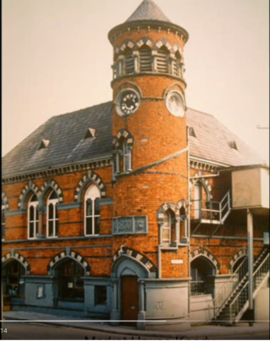

# A Céideadh 100 Bliain Ó Shin

# Brollach 

-----

## An Céideadh 100 Bliain Ó Shin

Sa leabhar bheag cháiliúil *Keady 100 Years Ago* , le Henry
Dobbin, ag bun an bhrollaigh, bhreac an t-údar tagairt den
am a raibh sé ag scríobh: Nollaig 1921 [^1]]

Anois, agus céad bliain caite ón Nollaig sin, tchífear domhsa,
gur rud fóirsteanach agus tairbheach leabhar beag eile de
leithéid *Keady 100 Years Ago* a scríobh. Agus tá sé de
dhánacht agam féin tabhairt faoi sin.

Maidir le hábhar suimiúil stairiúil a bhaineas leis an
bhaile, ba cheart teacht ar a leithéid a bheith giota maith
níos fusa i ré seo na ríomhairí agus na cumarsáide
domhanda idir ríomhairí, thar mar a bhí in aimsir Henry
Dobbin. Ar ndóighe, ní buntáiste í sin nach mbaineann a cuid
deacrachtaí agus dúshlán féin léi. Is féidir barraíocht de
rud ar bith a bheith ar fáil, sonraí faoi stair san áireamh.
An té a rachadh a chuartú ábhar staire, d'fhonn scríobh faoi
thopaic ar leith, gheobhaidh sé léar millteanach dá leithéid
ar an idirlíon, fríd *Google*  mar shampla. 

Is maith sin agus is an-mhaith é, gan amhras, ach tiocfaidh an
t-am gan mhoill, ina mbeidh air roghanna a dhéanamh as measc
an iliomad sonraí; agus an lód léitheoireachta féin a
thiocfadh a dhéanamh roimh rogha ar bith, bainfidh sí an-rud
ama as.  Mar sin féin, dá mba bheo don Dobbineach inniu, is
dóiche nach mbainfeadh ollchiste foinsí a uchtach de, sa
dóigh nach luífeadh sé isteach ar an obair; agus caithfidh
mé féin a bheith amhlaidh i gceann na hoibre s'agam féin.

Pádraig Mac Con Uladh  
An Mhín Mhór  
Nollaig 2021

--------------

[^1]:  H J. Dobbin Rathcarbry House, Keady, Christmas, 1921
